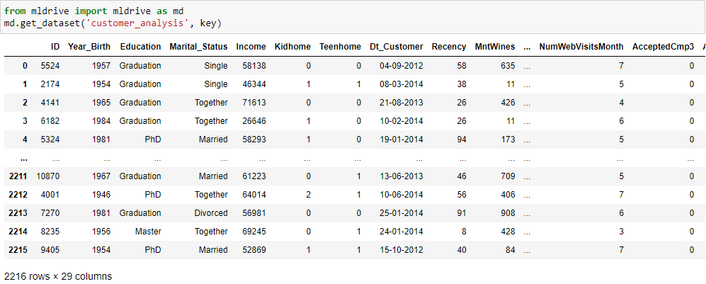
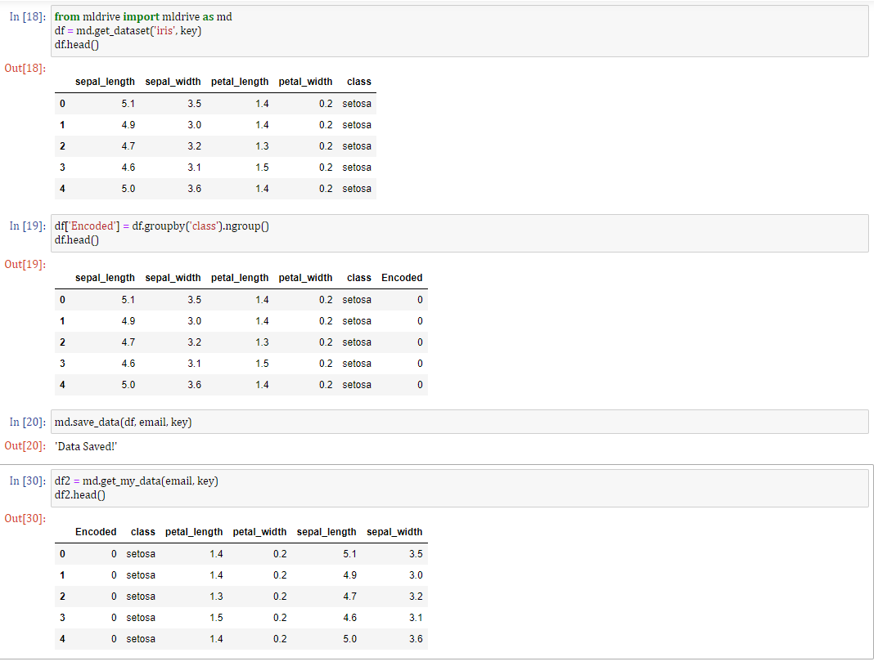
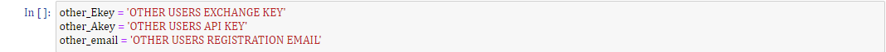
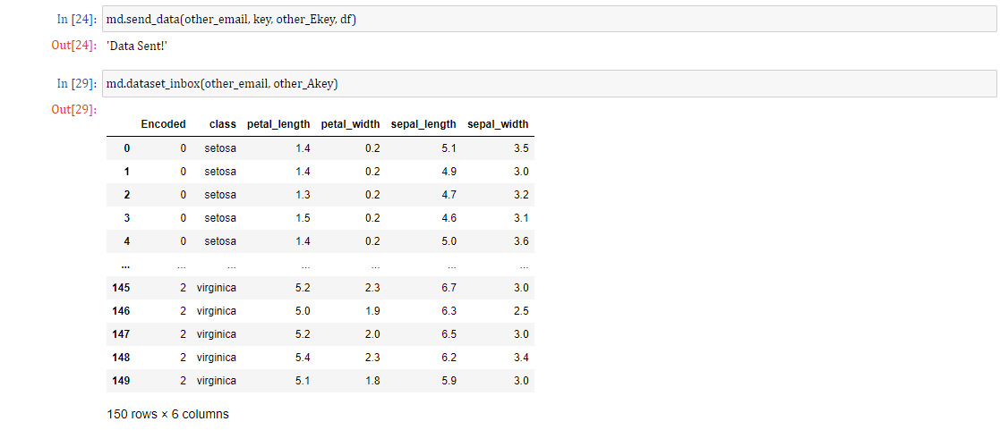

<h1 align="center">
   
  <a href="https://github.com/macdonac/mldrive">mlDrive</a>
</h1>

<h4 align="center">A wrapper for the mlDrive API</h4>

  <a href="#about">About</a> •
  <a href="#installation">Installation</a> •
  <a href="#documentation">Documentation</a> •
  <a href="#contributing">Contributing</a> •
  <a href="#support">Support</a> •

---

## About

<table>
<tr>
<td>
  
**mlDrive** is a wrapper class for the [mlDrive API](https://mldrive.io). The mlDRive API allows users to store their Pandas DataFrames & Scikit-Learn Models **externally** while maintaining the ability to access them **on the fly**. By eliminating the need to write back to a physical file when saving your work, mlDrive streamlines the in-between stages of your machine learning and data science projects, allowing you to make the best possible use of your time.

mlDrive also allows you to **send & recieve datasets** & models from other users. No more uploading or downloading .csv files in order to share your data with your peers: with mlDrive, data can be shared **instantaneously**. 

The mlDrive API additionally hosts a variety of easily accessible datasets: without the need to download any files whatsoever, mlDrive users can acquire and analyze these datasets at a moment's notice. This feature serves to bridge the gap between those who want to practice their data analysis skills and the actual datasets they will need in order to practice.

Our overall intention is for mlDrive to be an **easy-to-use, cloud-based solution for common inefficiencies in machine learning projects**. By minimizing the need to download & upload datasets, we hope to increase both the quality of life and productivity of machine learning developers everywhere.

## Installation

##### Downloading:
* Simply run **[pip install mlDrive](https://pypi.org/project/mldrive/)** from the command line.
##### Registration:
* Go to the **[mlDrive website](https://mldrive.io)** and follow the registration instructions to get your API key.

## A Few Examples:

1. Users can pull clean, non-trivial **sample datasets** from our database in an instant using the get_dataset() method, as seen below.

The default return type is a pandas DataFrame.

2. Users can save and load their own datasets using the save_data() and get_my_data() methods, respectively.
Note: We currently only support a single "save slot" per user, however we will eventually support multiple save slots.

3. Users can send datasets to other mlDrive users using the send_dataset() method and their given exchange key. To send a dataset to another user, you will need to have their exchange key:

Users can also check their dataset inbox to interact with data that has been sent to them via the dataset_inbox() method:

</td>
</tr>
</table>

## Documentation

Do you **need some help**? Refer to the [mlDrive documentation](https://mldrive.io/documentation).

## Contributing

Got **something interesting** you'd like to **share**? Open an issue or shoot us an email.
 

## Support

Reach out to us via **[email](support@mldrive.io)**.